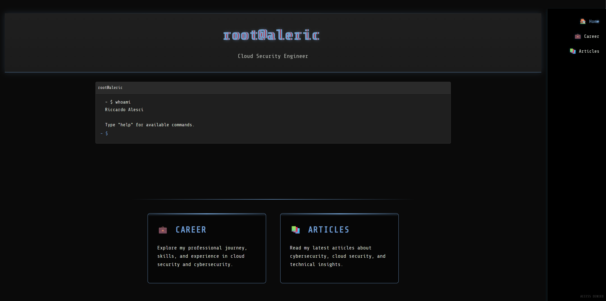

# root@aleric

A modern, interactive cybersecurity portfolio website built with React and TypeScript, featuring a Kali Linux-inspired terminal interface and responsive design.




## 📦 Installation

1. Clone the repository:
```bash
git clone https://github.com/aleeric/root-aleric.git
cd root-aleric
```

2. Install dependencies:
```bash
npm install
```

3. Start the development server:
```bash
npm run dev
```

4. Build for production:
```bash
npm run build
```


